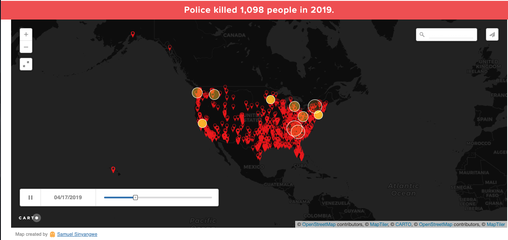

# Final Essay: Mapping Police Violence

In today’s intensive geography world, I picked a project called Mapping Police Violence due to its relevance to the world and social climate today. The goal of this project is to provide transparency and accountability for police departments as part of the ongoing campaign to end police violence. This project was made as a response to a lack of transparency with law enforcement agencies across the country about lives these agencies have taken. Despite the Death in Custody Reporting Act in the US, an act requiring reports on people who die under law enforcement custody, there is no indication of when this information would be released to the public. The major functions are to see points on a global map with options to zoom in, and with each point clicked, a popup containing information on the victim’s name, race, age, armed status, street address of death, agency responsible for death, description , link to news articles, and whether the officer was charged with a crime. Additional features include an animation from the beginning of 2019 showing these points blinking on the date they occurred in a time-lapse fashion. Furthermore, there are additional visualizations under the map to further support one’s goal of educating oneself on matters such as structural racism and police violence. This project is targeting the general public but more importantly the public that wants to keep the police department accountable for people they have killed. It should be noted that this project is made by Samuel Sinyangwe, who is affiliated with, We The Protesters, a national organization focused on ending racism and police violence in the United States.

On a technical standpoint, the architecture of this project has a client, a backend, and relies on a variety of 3rd party services to create said information product. The client is my browser which loads the information product from the [Mapping Police Violence](https://mappingpoliceviolence.org/) website, which renders the original information product which is hosted on the platform, CARTO, which also contains the server for this project. The services include using the OpenStreetMap API and MapTiler API. The data is kept on in a PostgreSQL database using a Redis Cached metadata database with a SQL API to allow for running SQL queries against CARTO. Having a clear architecture is key in creating a sustainable long-term project.

While understanding the architecture is important, looking into the details can help provide further insight into this project. For this project, the data flow is in one direction, from the server to the client. No action on the client’s end can impact the data in the server due to the nature of the project. The type of data includes, a rendered map, data points containing information on a police killing including the victim’s name, race, age, armed status, street address of death, agency responsible for death, description , link to news articles, and whether the officer was charged with a crime. This project uses Google Tag Manager and a variety of cartodb scripts most likely rendering and connecting to third party services such as OpenStreetMap, and MapTiler as well. This is for marketing and for rendering the information in the way the creator intended it to be. The project does support responsive design. It makes sense that a strong backend architecture would be paired with a high quality responsive design in the frontend. Providing a high quality user-experience perhaps explains why the author decided to host the project on CARTO.

Below is a code snippet of am embedded maptile:
```

```

From a visual standpoint, the map appears to be made of vector layers with the points symbol as rasters. From a user experience standpoint, the map provides a smooth and intuitive experience. With limited and straight forward functionality, the map provides a welcoming experience to explore and learn about the various cases of police-violence that have happened locally, statewide, nationally, and globally. While the user-experience is important, providing the proper map and interactive functions ultimately prove key to this information product’s user experience.

This project is made of a variety of features from the basemap, thematic layers, and interactive features. The basemap is a black base color with grey lines and titles of certain geographic regions such as continents, countries, cities, and neighborhoods upon being zoomed in. The basemap is also responsive. The thematic layer would be the raster layer containing all of the points which then contain interactive feature of being able to click them to present further information on the specific incident that occurred at that point. Further interactive features include being able to zoom in, being able to search for  a location and have the map animate and zoom to the location specified, and see the occurrences / points of police violence render over time with a timeline at the bottom of the map. Further inspection of the map can be found below.



Also, while it is important for web maps to contain elements such as a scalar bar, north, arrow, or legend, this one does not. The map contains sufficient features, however, that communicate the data in a clear concise manner, and elements such as those listed above would not add on to the user’s experience nor would it be central to the project’s goals. It would make sense then, that the simplicity of the web map  was intentional to support a smooth and intuitive user experience.

Overall, this project has a variety of strengths and weaknesses. Some strengths include easy and intuitive interactions with the map, interactive features to display data in a clear concise manner, and additional features that while are not related to the map itself, reflect certain statistics from the data in understandable ways. It should be noted that this is an organization focused on ending racism and police violence, so these statistics reflect do support the arguments that their cause makes such as police violence depends regionally and is disproportionately affecting black communities. Some weaknesses include the additional features outside of the map are not obvious and must be further found by scrolling under the initial map. While the webpage contains more statistics, not all of them are readily available to view and navigate to, ultimately taking away from the experience of interacting with the website to learn more about police violence and racism in the global and nationwide community. Below is a table summarizing these strenghts and weaknesses.

| Strengths     | Weaknesses    | 
| ------------- |:-------------:|
| easy / intuitive interactions      | Features outside of map are not obvious and must be found by scrolling |
| data displayed clearly and concisely      |       |
| external features paired with map tell narratives that would otherwise be uncaught by the map alone.|     |


While the map communicates how frequently and often police violence occurs in the United States, some additional statistics from the web page contribute to the map’s purpose as well. These statistics include that there were only 27 days in the year 2019 where police did not kill anyone. Additional statistics include the following cities all have police departments that kill black men at higher rates than the US murder rate.

1. Reno
2. Oklahoma City
3. Santa Ana
4. Anaheim
5. St. Louis City
6. Scottsdale
7. Hialeah
8. Madison

Were the map able to show these statistics additional to the simple click and present feature, it would make the map a stronger GIS project. All of the information in the map and outside of it on the webpage are to support an organization that supports a single initiative.

This project was made to support an organization focused on getting rid of police violence and racism within the United States, but supports other movements globally. In most recent times with protests against police violence and racial justice such as the Black Lives Matter movement as a result of long-term systematic oppression of black people, it makes GIS projects like these that much more important to support the movement and help induce change to a system that clearly exploits racist power dynamics. By having this project built by a non-government funded organization, it further creates accountability for a government and law enforcement in general. Having this information be public can help educate those who are not aware of police violence and the various racial disparities that show upon further analysis. Additionally, by having the data be crowdsourced, the organization does not have to rely on official statements that could take years to be made public.

In conclusion, this project was made by Samual Sinyangwe, who is affiliated with We the Protesters, a national organization focused on ending racism and police violence in the United States. The project targets the general public who wish to know and keep the police department accountable for people they have killed. Additionally, with recent protests against police violence and racist power structures, this map is also being used to support these protests. The map from a User-Experience standpoint provides a simple, but seamless experience of exploring the data, and seeing the details within each case. However, the pairing of data visualizations with the map elevates the users learning experience as they further explore the information product. By providing a means of  transparency and accountability for the police departments in the US, in particular, this GIS project shows real world impacts and supports real world causes. I believe that projects like these are a part of what make GIS so valuable in supporting global growth. As a graduating senior from UW, I am glad that I was able to find an intersection of social justice and GIS that I could explore, be inspired by, and learn from.
